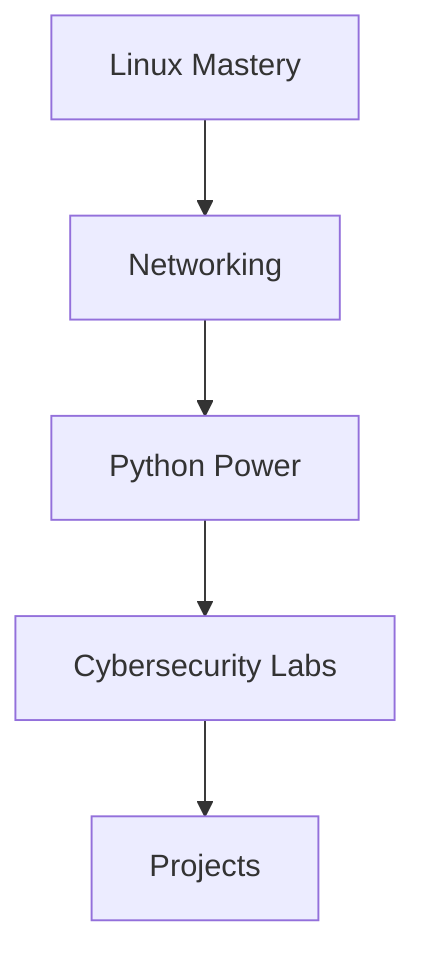

<!-- Animated Typing Header -->

  

---

  

<!-- Tech Badges -->

  
  
  
  
  

---

##  About Me

- 🛡️ Passionate about **cybersecurity**, **Linux**, and **networking**
- 🐍 Python & Bash scripting enthusiast
- 🧑‍🎓 Always learning through hands-on labs and real-world challenges
- 📝 Documenting my journey and projects right here on GitHub
- 💡 I love figuring out how things work — and sometimes, how to break them (ethically!)

---

## 🚀 Skills & Tools

|  |  |  |  |
| --- | --- | --- | --- |
| Terminal Wizardry | Scripting | CTFs | Networking |

- **CTFs & Cybersecurity Challenges:** TryHackMe, OverTheWire, and more  
- **Automation:** Turning repetitive tasks into scripts

---

##  My Learning Roadmap

1. **Linux Mastery:** Deep dive into the command line and system internals  
2. **Networking:** Understanding how computers connect and communicate  
3. **Python Power:** Automating tasks and building small tools  
4. **Cybersecurity Labs:** Practicing on CTF platforms and wargames  
5. **Projects:** From scripts to security tools, all documented here!

---

## 🌟 Currently Working On

- 🛠️ Building custom tools to automate boring tasks
- 🧩 Completing new challenges on TryHackMe and OverTheWire
- 🌱 Contributing to open-source

---

## ⚡ Fun Fact

  

I love automating everything I can — and if there’s a challenge, I can’t resist solving it!

---

<!-- Social links: Uncomment and add yours! -->
<!--
## 🌐 Connect with me

  
  
  

-->

---

  
🎁 <b>Secret Challenge</b> (Click Me!)

   
  
  

    Want to learn a hacking trick?  
    Try running <code>nc -lvnp 1337</code> in your terminal and see what happens!  
    (Always hack ethically! 😉)
  

---

  <b><i>“The best way to learn is to break, fix, and repeat.”</i></b>

